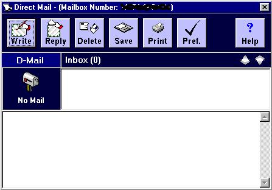

<div align="center">

## D\-Mail \(Updated\)


</div>

### Description

UPDATED WITH .BAS FILES INCLUDED

'D-Mail' uses tcp/ip to send mail between the sender and recipient. It has a nice interface and some good features in mind. You cannot send/receive 'E-Mail', nor can you Attach files with this application as of yet. But you can send mail with another user of this application. PSC would not allow me to upload a 608kb project for some annoying reason, so I uploaded it to another site at:

http://sesphp.homestead.com/files/D-Mail.zip
 
### More Info
 


<span>             |<span>
---                |---
**Submitted On**   |
**By**             |[CovertLoop](https://github.com/Planet-Source-Code/PSCIndex/blob/master/ByAuthor/covertloop.md)
**Level**          |Intermediate
**User Rating**    |5.0 (10 globes from 2 users)
**Compatibility**  |VB 6\.0
**Category**       |[Internet/ HTML](https://github.com/Planet-Source-Code/PSCIndex/blob/master/ByCategory/internet-html__1-34.md)
**World**          |[Visual Basic](https://github.com/Planet-Source-Code/PSCIndex/blob/master/ByWorld/visual-basic.md)
**Archive File**   |[](https://github.com/Planet-Source-Code/covertloop-d-mail-updated__1-14151/archive/master.zip)


### Source Code

```
Get it at:
http://sesphp.homestead.com/files/D-Mail.zip
```

